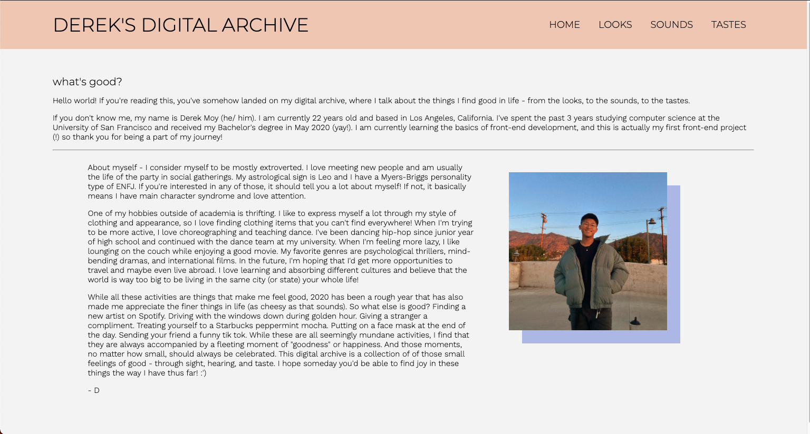
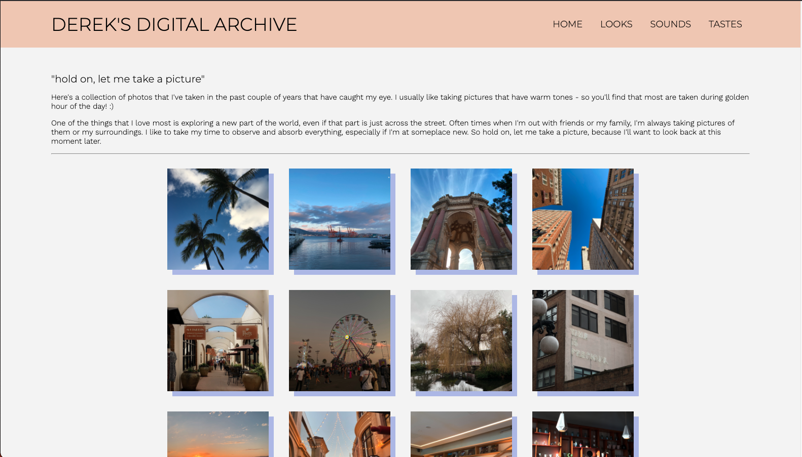
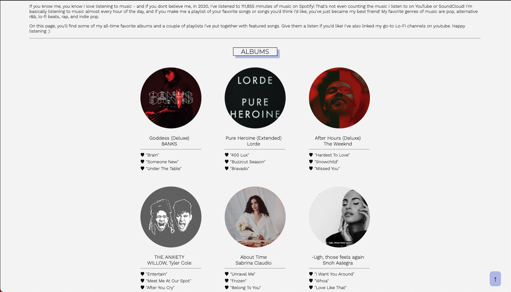
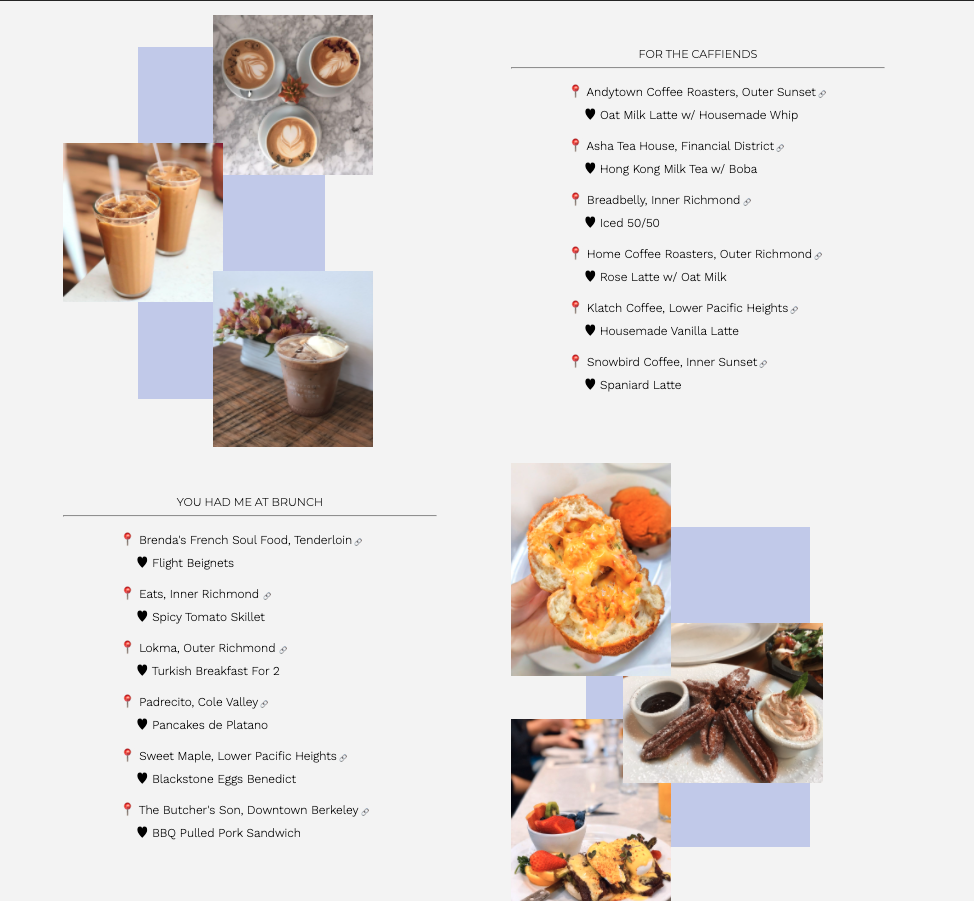

# Digital Archive 

## About 
This is a personal project that contains information about myself and answers the question: "what's good?". This is a multi-page site that serves as a time capsule for what I think looks, sounds, and tastes good to me at this stage of my life. 

## Objective 
This digital archive is a front-end project that focuses on utilizing the basics of HTML and CSS. More specifically, it utilizes:
* Flex-Box containers/ items
* CSS Grids
* Navigation Design
* CSS Transitions 
* Interactive HTML/ CSS Design 

## Home Page 
On the landing page of the site, you will find a short essay about myself including my academic achievements, personal hobbies, and my personality type. 

## Looks Page 
On the Looks page, you will find a collection of pictures that I find look good to me. All photographs included on this page has been taken by me over the pase several years. Upon hovering over each image, an overlay will drop down, revealing the location of where the image was taken. 

## Sounds Page 
On the Sounds page, I've included the music that sounds good to me. The page is separated into 3 sections: albums, playlists, and youtube. On the albums section, I've included 6 of my favorite albums at the time as well as my top 3 songs from each album. In the playlist section, I've linked 2 of my personal playlists that I have made that sound good to me, as well as 9 of my favorite songs from each playlist. Upon hovering over each album cover or playlist cover, an overlay will appear that will link the user to the playlist or album on Spotify upon clicking the "play button". In the YouTube Section, I've embedded 2 of my favorite YouTube tracks that I like listening to. Clicking the title will also link the user to the YouTube video directly. 

## Tastes Page 
On the Tastes page, I've divided it into 3 different sections: coffee, brunch, and dinner. Each section includes my favorite places to go to located in San Francisco. Clicking each cafe/ restaurant name will direct the user to the respective Yelp page. 

## Running 
This website is not currently being hosted on a server/ domain. If you would like to access it, you may download the files as a .zip and run index.html locally on your device. The website is not intended to be viewed on a mobile device as most elements require mouse hovering for interaction.
